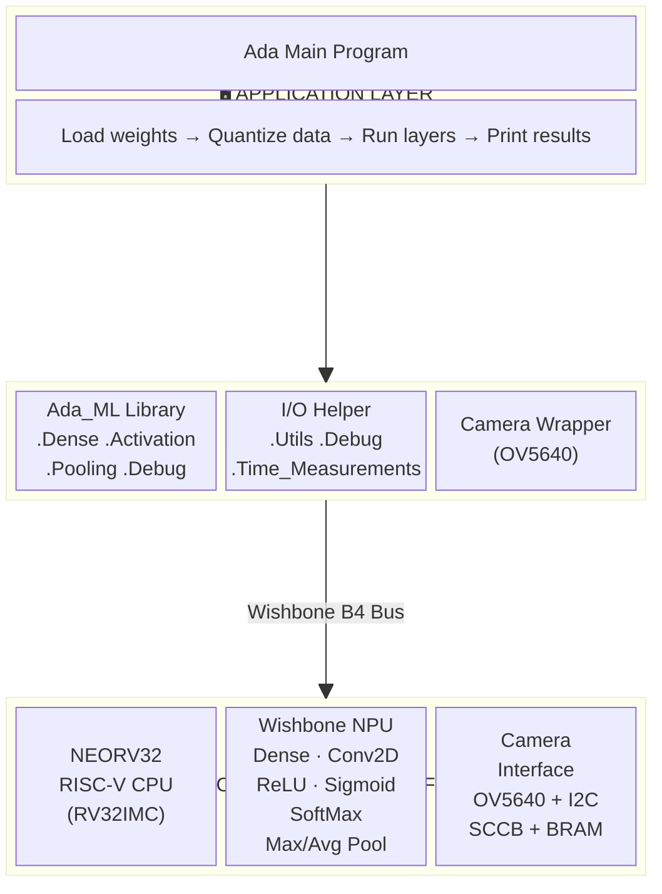
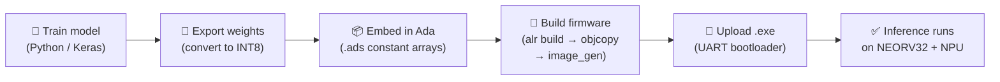

# Wishbone NPU

**A minimal, open-source Neural Processing Unit for RISC-V soft-core SoCs — built from the ground up in VHDL and Ada.**

The Wishbone NPU is a hardware peripheral that accelerates neural network inference on embedded systems. It connects to any processor with a [Wishbone B4](https://cdn.opencores.org/downloads/wbspec_b4.pdf) bus and offloads common ML operations — dense layers, convolutions, activations, and pooling — to dedicated hardware. Instead of burning CPU cycles on matrix math, you write operands to the NPU, trigger an operation, and read back results.

The reference implementation runs on the [NEORV32](https://github.com/stnolting/neorv32) RISC-V soft-core on a **Lattice ECP5** FPGA, with an Ada firmware stack and multiple demo applications. The NPU itself is platform-independent VHDL — it works with any Wishbone master on any FPGA.

Developed as a capstone project at Penn State, sponsored by [AdaCore](https://www.adacore.com/).

---

## Architecture

The system is organized into three layers. The application never touches hardware directly — the firmware layer translates high-level calls into register operations, and the NPU executes them in hardware.



---

## Supported Operations

The NPU handles all operations through a single Finite State Machine controlled by opcodes. Data is stored as **4 INT8 values packed per 32-bit word** in on-chip BRAM tensor windows.

| Operation | What It Does | Data Format |
|-----------|-------------|-------------|
| **Dense (INT8 GEMM)** | Fully connected layer — MAC with INT32 accumulator, requantize to INT8 | INT8 in → INT32 intermediate → INT8 out |
| **Conv2D** | 2D convolution with N×N kernel + bias. Output: (H−K+1)×(W−K+1) | INT8, signed 20-bit accumulator |
| **ReLU** | max(0, x) on 4 packed INT8 values per word | INT8 (Q0.7) |
| **Sigmoid** | Linear-approximated sigmoid on 4 packed values | INT8 (Q0.7) |
| **SoftMax** | Two-phase: exponents + running sum, then divide | INT8 (Q0.7) |
| **Max Pooling** | 2×2 window → maximum value | INT8 |
| **Average Pooling** | 2×2 window → average value | INT8 |

---

## Repository Structure

```
Wishbone-NPU/
├── RTL/                 # Current NPU peripheral (VHDL) — the reusable IP
├── Ada Files/           # Ada firmware: ML driver library + demo applications
├── Python Files/        # Model training (Keras) + weight conversion scripts
├── FPGA Setup/          # NEORV32 board integration (top-level VHDL, .lpf, TCL)
├── ECP5 Files/          # Lattice ECP5-specific build resources
├── Prebuilt Demos/      # Ready-to-flash bitstreams and binaries (no build tools needed)
└── RTL History/         # Archived older versions of the NPU VHDL
```

Each folder has its own README with details on contents and usage.

---

## End-to-End Workflow

This diagram shows how a trained model goes from your PC to running on the FPGA:



**Step by step:**

1. **Train** a model in Python/Keras (see [`Python Files/`](Python%20Files/))
2. **Export** weights to INT8 fixed-point using the weight conversion script
3. **Embed** the exported weights as Ada constant arrays in a firmware project
4. **Build** with Alire → `riscv64-elf-objcopy` → `image_gen` → `.exe`
5. **Upload** via UART bootloader (GTKTerm) → results print to serial console

---

## Quick Start

### Prerequisites

| Tool | Purpose | Install |
|------|---------|---------|
| [Alire](https://alire.ada.dev/) | Ada build system (installs GNAT + RISC-V cross-compiler) | `curl -L https://alire.ada.dev/install.sh \| sh` |
| `image_gen` | Converts binary → NEORV32 executable | Build from [NEORV32 repo](https://github.com/GNAT-Academic-Program/neorv32-setups) `sw/image_gen/` |
| [Lattice Diamond](https://www.latticesemi.com/latticediamond) | FPGA synthesis for ECP5 | Free license from Lattice |
| [GTKTerm](https://github.com/Jeija/gtkterm) | Serial terminal for UART upload | `sudo apt install gtkterm` |
| [Python 3](https://www.python.org/) + [Keras](https://keras.io/) | Model training and weight export | `pip install keras numpy` |
| [GHDL](https://github.com/ghdl/ghdl) + [GTKWave](https://gtkwave.sourceforge.net/) | VHDL simulation and waveform viewing (optional) | `sudo apt install ghdl gtkwave` |

<details>
<summary><strong>Full environment setup (Ubuntu 24.04)</strong></summary>

```bash
sudo apt update && sudo apt -y upgrade
sudo apt install -y build-essential git cmake make python3 python3-venv
sudo apt install -y ghdl gtkwave curl
curl -L https://alire.ada.dev/install.sh | sh
alr index --reset-community
alr toolchain --select
sudo apt install gtkterm

# Build image_gen
git clone --recurse-submodules https://github.com/GNAT-Academic-Program/neorv32-setups.git
cd neorv32-setups/neorv32/sw/image_gen
gcc image_gen.c -o image_gen
sudo cp image_gen /usr/local/bin/
```

Verify: `which riscv64-elf-objcopy && which image_gen && ghdl --version`
</details>

### Build and run a demo

```bash
# Build firmware (example: MNIST 28×28)
cd "Ada Files/ADA_DEMO_FIRMWARE/MNIST_28x28_TEST"   # adjust path to match actual layout
alr build
riscv64-elf-objcopy -O binary bin/test_cases_neorv32 bin/test_cases_neorv32.bin
image_gen -app_bin bin/test_cases_neorv32.bin bin/test_cases_neorv32.exe

# Upload to NEORV32 via UART
# 1. Open GTKTerm:  gtkterm --port /dev/ttyUSB0 --speed 19200
# 2. Set Configuration → CR LF Auto
# 3. Reset board → press 'u' → Ctrl+Shift+R → select .exe → press 'e'
```

### Synthesize the FPGA design

```bash
cd "FPGA Setup"
pnmainc <tcl_script_name>.tcl
```

See [`FPGA Setup/README.md`](FPGA%20Setup/README.md) for full details.

---

## Using the NPU in Your Own Design

The NPU peripheral in [`RTL/`](RTL/) is a self-contained Wishbone B4 slave with **no dependencies** on the NEORV32 or any specific FPGA.

1. Add the NPU VHDL files to your project.
2. Connect its Wishbone slave port to your bus interconnect.
3. Assign it a base address in your memory map.
4. Write data to tensor windows A/B/C, set the opcode in CTRL, assert start, poll STATUS for done, read results from tensor R.

See [`RTL/README.md`](RTL/README.md) for the register map and [`Ada Files/README.md`](Ada%20Files/README.md) for the exact access patterns in code.

---

## Contributing

Contributions are welcome — especially ports to new FPGA boards and new NPU operations. Please open an issue or PR.

**Code style**: VHDL formatted with [VHDL Formatter](https://g2384.github.io/VHDLFormatter/), Ada follows GNAT conventions (PascalCase for packages/procedures), Python follows PEP 8.

---

## Acknowledgments

- **[AdaCore](https://www.adacore.com/)** — industry sponsor; project mentor Oliver Henley
- **[NEORV32](https://github.com/stnolting/neorv32)** by Stephan Nolting — the RISC-V soft-core processor
- **[GNAT Academic Program](https://github.com/GNAT-Academic-Program/neorv32-setups)** — NEORV32 + Ada integration
- **Penn State University** — capstone course, instructor/advisor Naseem Ibrahim
