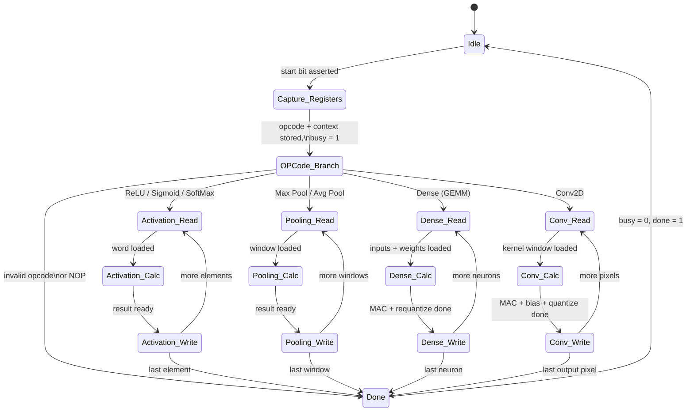
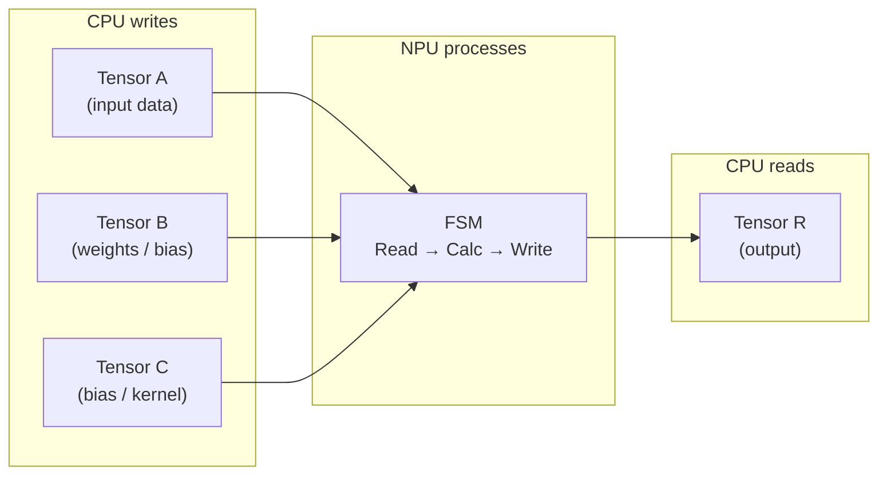

# RTL — NPU Peripheral

This directory contains the current, production version of the Wishbone NPU — a hardware peripheral that accelerates neural network operations.

## Overview

The NPU is implemented as a **single Finite State Machine (FSM)** that handles all operations through opcode dispatch. This design reduces LUT usage by reusing the Wishbone bus logic across every operation, rather than having separate hardware modules for each one.

## NPU State Machine

Each operation follows the same pattern: **Read** input data from tensor windows → **Calculate** the result → **Write** to tensor R. Simple operations (ReLU) complete their read in one cycle; complex operations (Conv2D, Dense) use composite read states that span multiple cycles to load all required data.

## Tensor Windows

Data is stored as **4 INT8 values packed into each 32-bit word**. The NPU uses on-chip BRAM tensor windows for all data:

| Window | Used for Dense | Used for Conv2D | Used for Activation / Pooling |
|--------|---------------|-----------------|-------------------------------|
| **A** | Input vector | Input image | Input tensor |
| **B** | Weight matrix | Bias value | — |
| **C** | Bias vector | Kernel weights | — |
| **R** | Output vector | Output feature map | Output tensor |

## Key Registers

| Register | Purpose |
|----------|---------|
| CTRL | Start bit + opcode field |
| STATUS | Busy / done flags |
| DIM | Tensor dimensions |
| WORD_INDEX | Current word index for element-wise ops (ReLU, Sigmoid, SoftMax) |
| POOL_BASE_INDEX | Top-left index for pooling window |
| WEIGHT_BASE_INDEX, BIAS_INDEX, N_INPUTS | Dense layer configuration |
| SCALE, ZERO_POINT, QUANT_MULTIPLIER, QUANT_MULTIPLIER_RIGHT_SHIFT | Requantization (Dense) |
| SUM, SOFTMAX_MODE | SoftMax phase control |

## Internal VHDL Packages

The NPU top-level imports distinct packages to separate reusable math from bus/FSM logic:

| Package | Responsibility |
|---------|----------------|
| `tensor_operations_basic_arithmetic` | Tensor types/constants, packed INT8 add/sub utilities |
| `tensor_operations_dense` | MAC and requantization helpers |
| `tensor_operations_conv2d` | Conv2D operation logic |
| `tensor_operations_activation` | ReLU, Sigmoid, SoftMax helpers |
| `tensor_operations_pooling` | 2×2 index math, max/average functions |

## Wishbone Interface

Standard Wishbone B4 slave: `wb_clk_i`, `wb_rst_i`, `wb_cyc_i`, `wb_stb_i`, `wb_we_i`, `wb_adr_i`, `wb_dat_i`, `wb_dat_o`, `wb_ack_o`.

## Using in Your Own SoC

The NPU has **no dependencies** on the NEORV32 or any specific FPGA — it is pure behavioral VHDL.

1. Add the VHDL files from this directory to your synthesis project.
2. Connect the Wishbone slave port to your bus interconnect.
3. Assign a base address.
4. From your CPU: write data to tensor windows, configure registers, set opcode in CTRL, assert start, poll STATUS for done, read results from tensor R.

The Ada ML library in [`Ada Files/`](../Ada%20Files/) demonstrates the exact register access sequence for every operation.

## Older Versions

Archived versions from earlier in development are kept in [`RTL History/`](../RTL%20History/) for reference.
